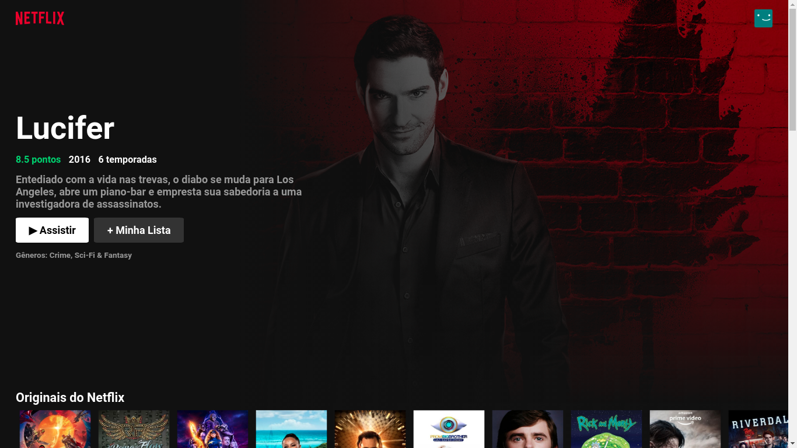
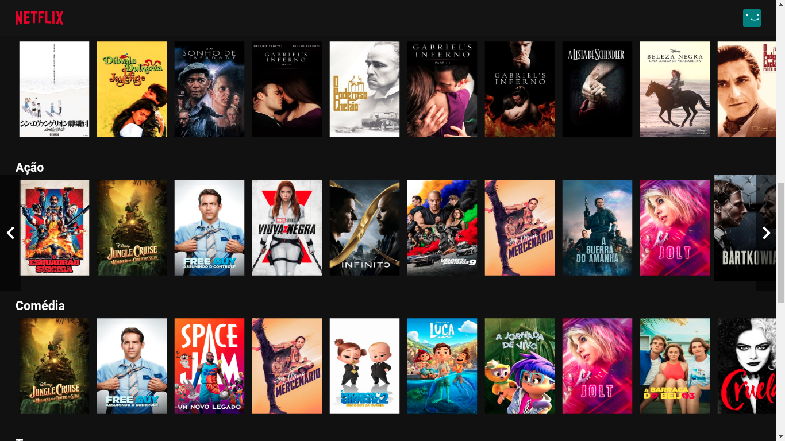
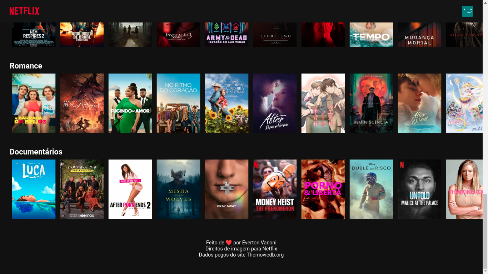
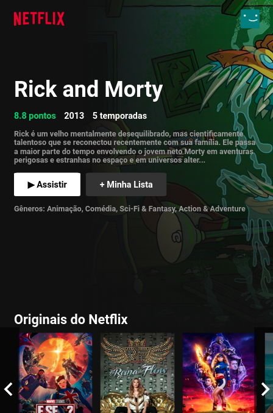
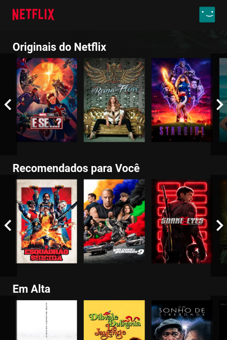
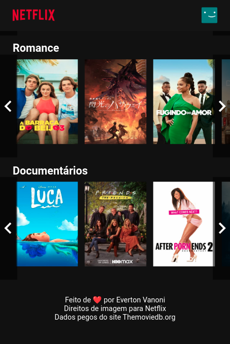

<h1 style="text-align: center;">Clone da Netlix</h1>
    <h3>Página de seleção de conteúdo feito usando o React com responsividade e toda animação igual a Netflix original.</h3>
    <strong>
        
Créditos de conteudo: https://www.netflix.com/br/

        
API usada: https://www.themoviedb.org/

    </strong>
    <h2 style="text-align: center;">Imagens da Página</h2>
    
    
    
    

        
        
        
    

